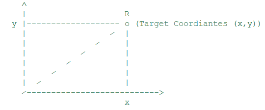
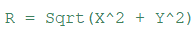
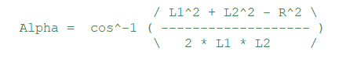
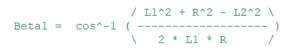

# 2-Link-Robots-Inverse-Kinematics-Solver-2Dimensional-Apr-2018
Java code that calculates the joint angles of any arbitrary 2 link robot.

The goal is to find Alpha & Beta.

## Steps
- We first identify the point

- Calculate R using the method that returns the result of this equation:

- Calculate Alpha 

- Calculate Beta 2 which is equal to atan2 ( Y , X )

- Calculate Beta 1

- Find Beta using the equation  Beta = 180 * ( ( Beta1 + Beta2 ) / PI )
